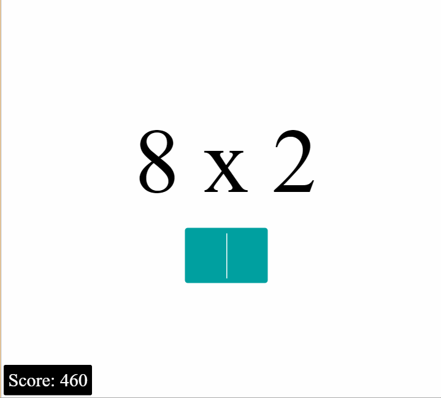

# HTML5 multiplication game

A simple game made with [React] and [redux]. [Play it!]



## Develop

```bash
git clone https://github.com/arve0/multiplication-game
cd multiplication-game
npm install
npm start
```

## Dist
```bash
npm run build
```
Distribute files in [dist](dist).

## License

[MIT](LICENSE).

Scaffolded with [react-transform-boilerplate] [CC0 (public domain)].

[React]: https://facebook.github.io/react/index.html
[redux]: http://redux.js.org/
[Play it!]: http://arve0.github.io/multiplication-game
[react-transform-boilerplate]: http://github.com/gaearon/react-transform-boilerplate
